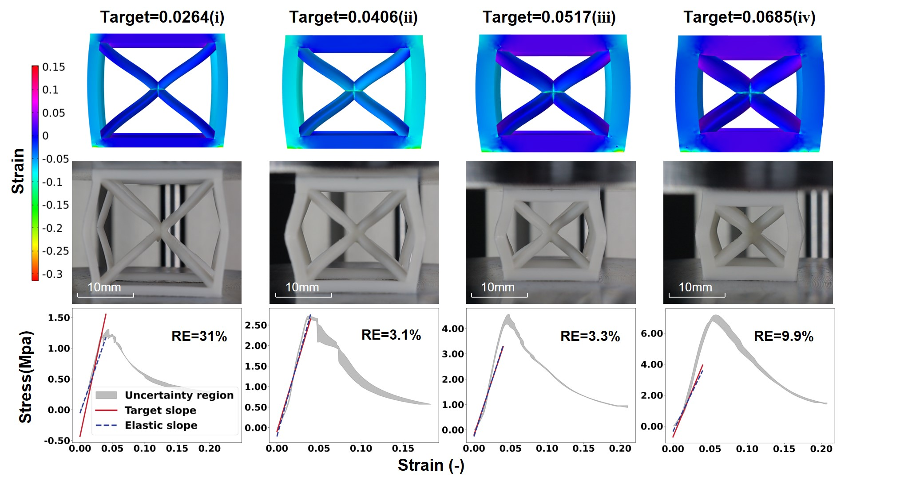

## Current
Hello, I am Jiacheng Xue（薛嘉诚）, a master student at [**Xi’an Jiaotong University**](https://en.xjtu.edu.cn/). I am in  advised by [**Prof. Lingling Wu**](https://gr.xjtu.edu.cn/en/web/lingling.wu/home).

## Research interrests

Jiacheng’s research focuses on developing innovative solutions in robotics design and development, mechanical metamaterials, machine learning-based inverse design, and composite materials. By integrating mechanics, computational methods, and advanced manufacturing, his work aims to contribute to advancements in enhancing metamaterials’ applications in robotic fields.

## Research Experience

  
  
   
  <em style="display: inline-block; width: 50%;">inverse design and post-processing.</em>

