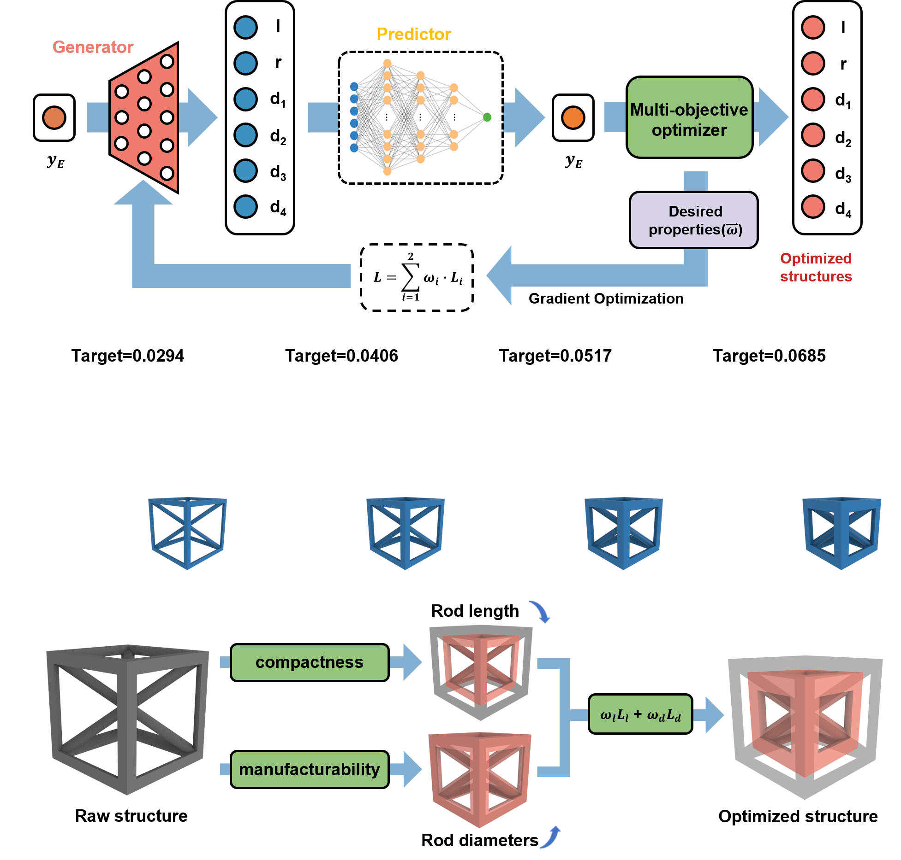

## Current
I am seeking a PhD position in Mechanical Engineering.

## Short Bio
Jiacheng Xue is a Master’s student in Mechanical Engineering at Xi’an Jiaotong University. Originally from Xi'an, China, he earned his undergraduate degree from Xi’an Jiaotong University (2019–2023) and is pursuing a master’s degree at the same institution (2023–Present). 

Jiacheng’s research focuses on developing innovative solutions in robotics design and development, mechanical metamaterials, machine learning-based inverse design and composite materials. By integrating mechanics, computational methods, and advanced manufacturing, his work aims to contribute to advancements in enhancing metamaterials' applications in robotic fields.

## Research Experience

