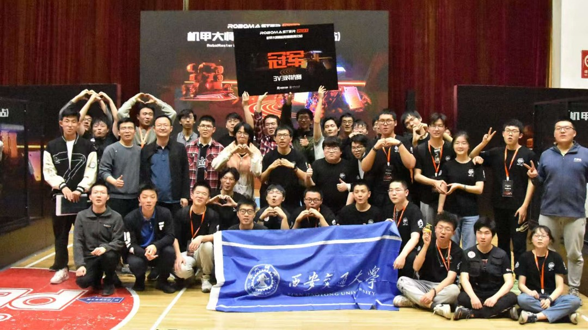
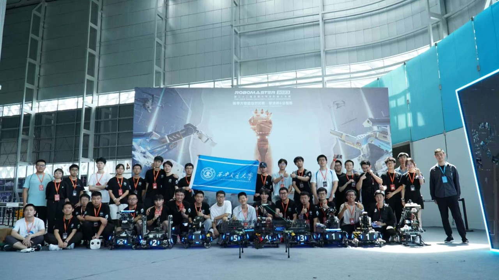
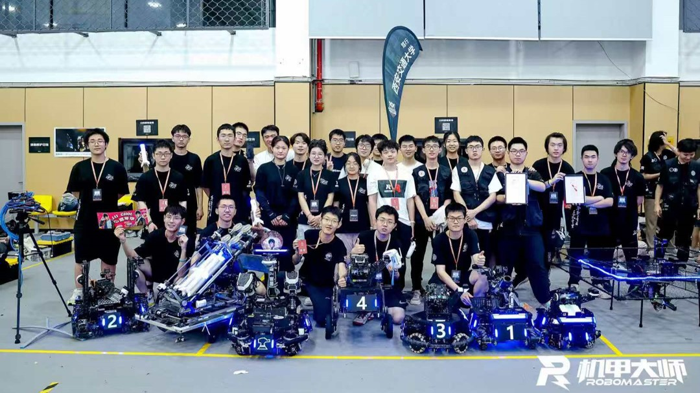

# RoboMaster Experience

## About RoboMaster
[**RoboMaster**](https://www.robomaster.com/en-US), organized by DJI, is an annual robotics competition where university teams design robots to compete in challenges. It emphasizes innovation, teamwork, and technical skills in robotics, including mechanical design, electronics, and software development.

## My Journey in RoboMaster

I devoted the majority of my university years to the **DuXing** RoboMaster team, where I experienced tremendous growth both technically and personally. Many professors and friends often asked why I poured so much time and energy into something that seemed to offer little tangible return—neither financial gain nor traditional academic output. But my answer never changed: 

*"Every time I structured a mechanical system or wrote a line of control code, it felt like I was breathing life into a machine. In those moments, I wasn’t just building a robot—I was building a part of myself."*

**Only love.** 

### 2021: Sentinel Robot Chassis Design
As part of the mechanical team, I designed the chassis for the Sentinel robot, focusing on stability and maneuverability through mechanical engineering principles and structural optimization.

### 2022: Infantry Robot Chassis Design
I designed the Infantry robot chassis, prioritizing speed, durability, and adaptability to various terrains, enhancing the team's competitive performance.

  

    
  

  

    
  

My innovative designs for the Infantry robot family, showcasing a blend of functionality and creativity.

### 2023: Team Captain
As team captain, I led the team to equal its historical best performance, reaching the national top 16. My role involved strategic planning, team coordination, and optimizing robot design and performance. 

  

    
  

  

    
  

Team Captain leading the team during the 2023 RoboMaster competition. First champion in the history of our team.

### 2024: Team Advisor
Transitioning to team advisor, I guided the team to break its historical record by reaching the national top 12, showcasing continuous improvement and innovation.

  
  
Participate in training competition

## History of Our Team - **DuXing(笃行)**
I am truly honored to have spent my undergraduate years as part of the **DuXing** Robotics Team at Xi'an Jiaotong University. This remarkable team has not only provided me with invaluable friendships but also extraordinary opportunities for personal and professional growth. I sincerely hope that the **DuXing** team will continue to push boundaries, reach new heights, and achieve even greater success in the future.

  

    
  

  

    
  

Our team's first championship in history (April 2023). Returning to Shenzhen for the National Competition (August 2023).

  

    
  

  

    
  

Achieving our team's best historical record - Top 12 (May 2024 - August 2024).

