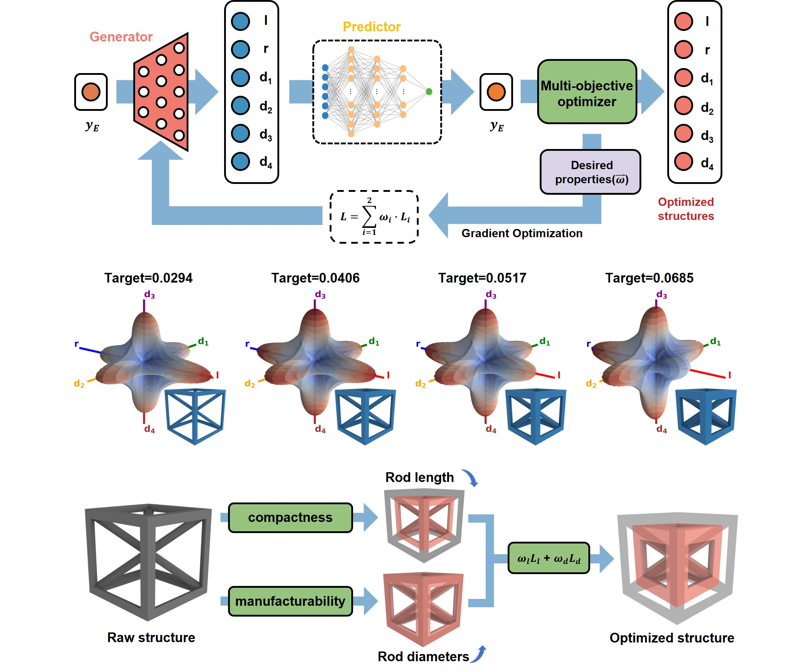

# Inverse Design for Metamaterials

Inverse design methodologies for metamaterials leverage machine learning to create diverse, high-accuracy structures with tailored properties. This research enhances design variety and accelerates analysis, enabling precise responses to mechanical stimuli for applications in advanced composites and adaptive structures.

# Mobile Robotics Developing

The Mobile 3D Printing Robot revolutionizes additive manufacturing by integrating a dynamic, flexible chassis that significantly expands the printing area beyond traditional constraints. This innovative design enhances mobility and adaptability, enabling large-scale, high-precision fabrication for diverse applications in advanced manufacturing and adaptive construction.

# 3D Printer Online Monitoring

The Mobile 3D Printing Robot revolutionizes additive manufacturing by integrating a dynamic, flexible chassis that significantly expands the printing area beyond traditional constraints. This innovative design enhances mobility and adaptability, enabling large-scale, high-precision fabrication for diverse applications in advanced manufacturing and adaptive construction.
