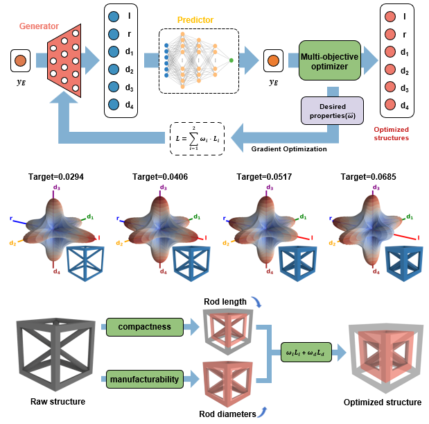
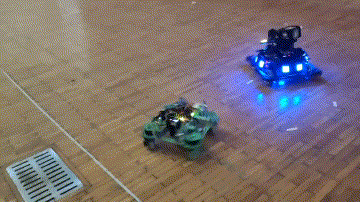
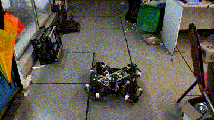
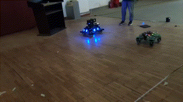
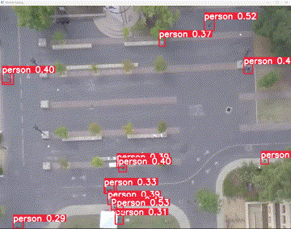
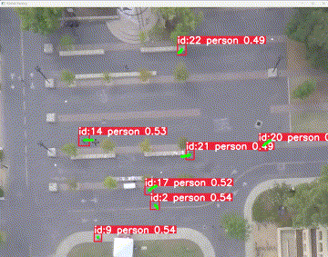
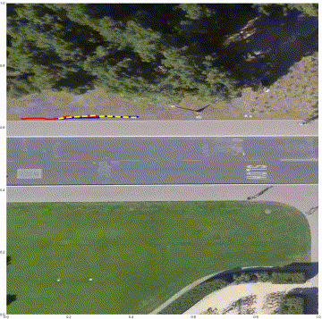
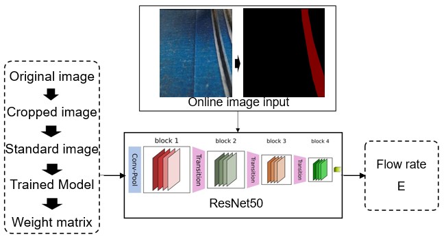

# Inverse Design for Metamaterials

Inverse design methodologies for metamaterials leverage machine learning to create diverse, high-accuracy structures with tailored properties. This research enhances design variety and accelerates analysis, enabling precise responses to mechanical stimuli for applications in advanced composites and adaptive structures.

*This section will be shown once the related paper is published.*

<!-- 

  

 -->

# Mobile Robotics Developing

  
  
Overview of mobile robotics research and development

## 3D Printing Robot

This project features an omnidirectional chassis combined with a robot arm, enabling mobile and flexible 3D printing operations.

  
  
Demonstration of the mobile 3D printing robot in action

## RoboMaster Competition

This section introduces my research and development of omnidirectional chassis technology for the RoboMaster Competition, focusing on advanced mobility and control strategies for competitive robotics.

  

    
  

  

    
  

  

    
  

Demonstrations of omnidirectional chassis tests in RoboMaster research

## Pedestrian Trajectory Prediction

This project focuses on predicting pedestrian trajectories using UAV (Unmanned Aerial Vehicle) vision. Leveraging YOLOv8 for real-time pedestrian detection and Social-GAN for trajectory prediction.

  

    
    
Pedestrian Recognition (YOLOv8-based detection)

  

  

    
    
Pedestrian Following (UAV tracking)

  

  

    

      
    

    
Trajectory Prediction (Social-GAN)

  

## Online Monitoring of 3D Printer

This project presents an advanced system that integrates Mask-RCNN and Octoprint for real-time fracture detection and parameter monitoring in 3D printing. The system achieves 94.7% and 97.7% recognition accuracies for pure materials and fiber-reinforced composites, respectively, enabling reliable quality assurance during additive manufacturing.

  <!-- 图1 -->
  

    
    
Visualization of the online monitoring system for 3D printers

  

  <!-- 图2 -->
  

    
    
Pedestrian Following (UAV tracking)

  

