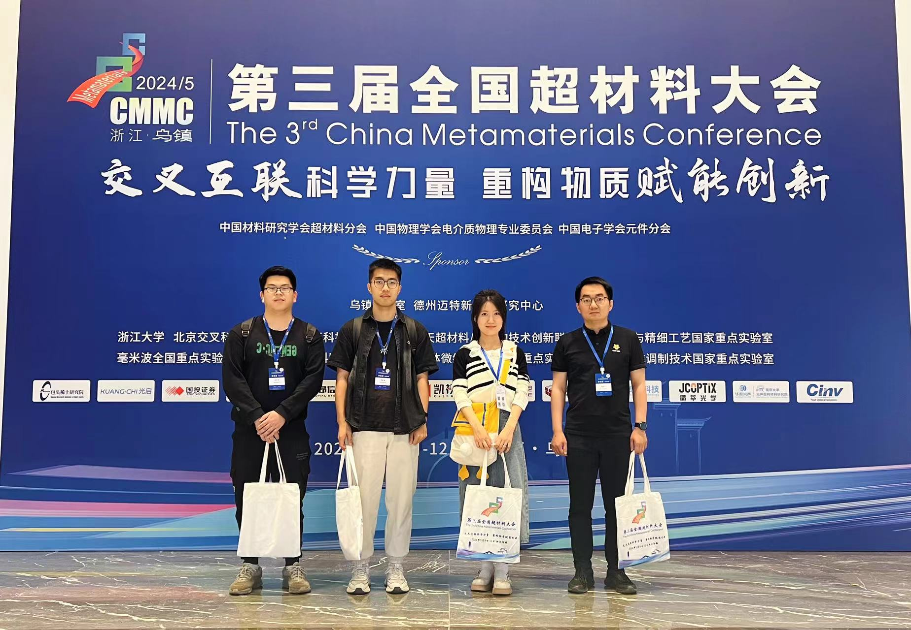
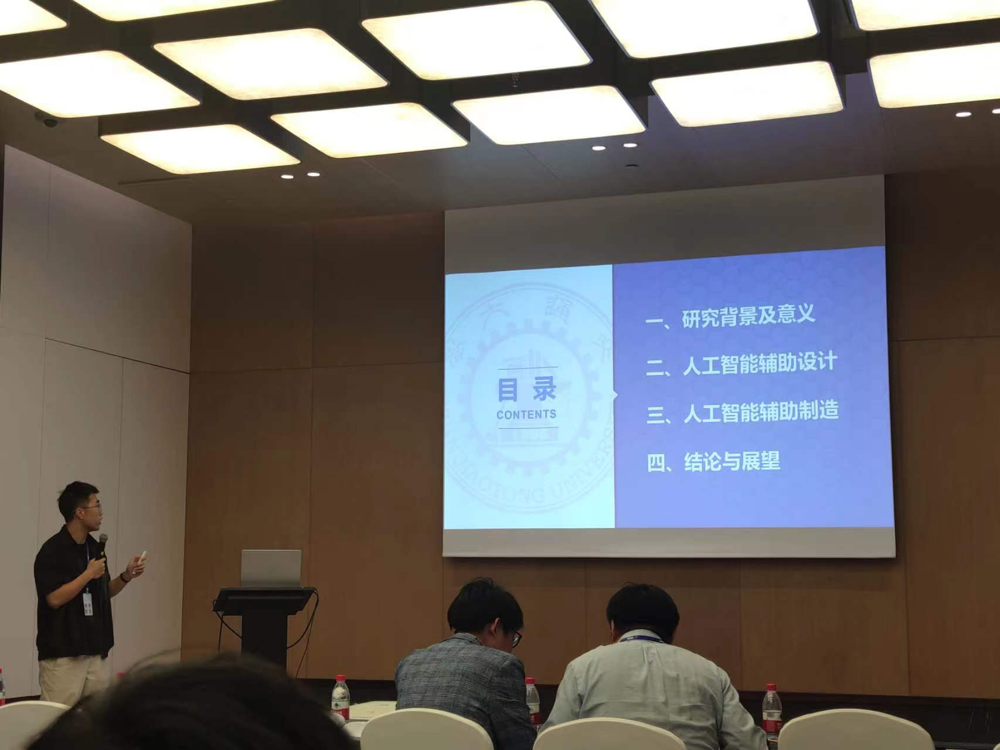
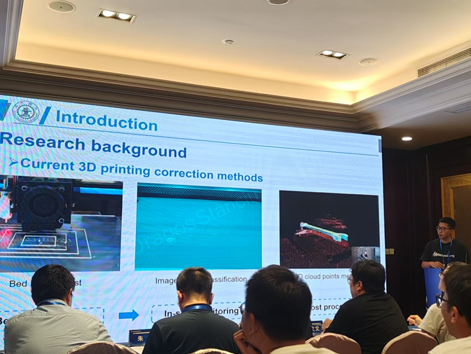
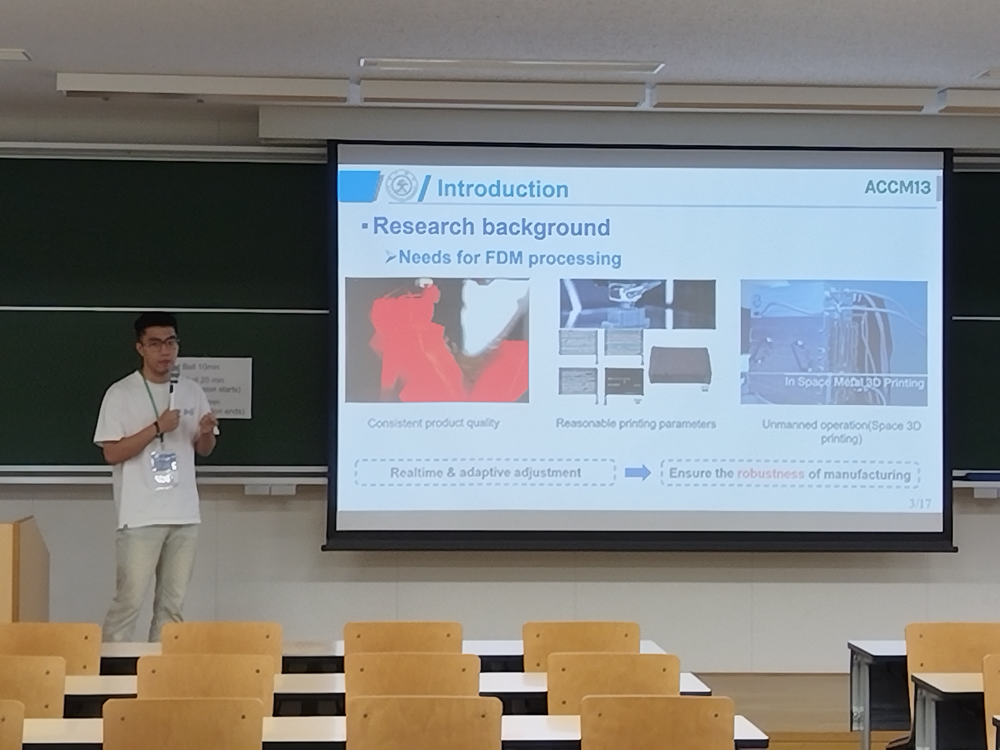
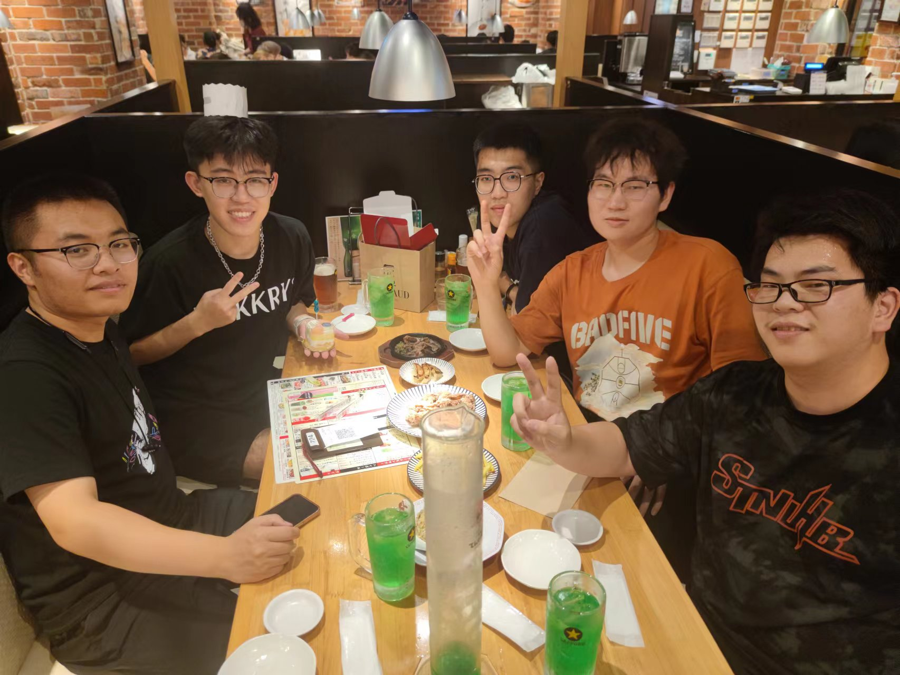

## Presentations

- **Machine Learning-based Inverse Design of Mechanical Metamaterials**  
  *3rd China Metamaterials Conference, Jiaxing, China — May 2024*  
  Presented research on applying machine learning to the inverse design of mechanical metamaterials.

- **Composite Material Innovations**  
  *13th Asian-Australasian Conference on Composite Materials, Kyoto, Japan — Aug. 2024*  
  Delivered a talk on recent innovations in composite materials.

- **Inverse Design and 3D Printer Online Monitoring**  
  *High-end Equipment Conference*  
  Introduced recent work on inverse design and online monitoring techniques for 3D printing.

<!-- Highlighted main image -->

  

    
    

      Presenting at the 3rd China Metamaterials Conference, Jiaxing (with Prof. Lingling Wu, right two)
    

  

<!-- Other images in a row -->

  

    
    
Presenting at the 3rd China Metamaterials Conference, Jiaxing

  

  

    
    
Sharing at the Manufacturing Conference, Taiyuan, Shanxi

  

  

    
    
Kyoto Conference Presentation

  

  

    
    
Dinner in Kyoto

  

